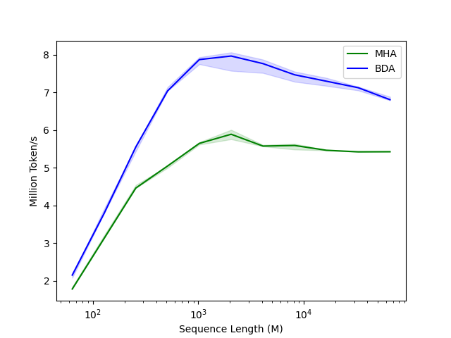

# Basis Decomposition

## Installation

Ensure you have the necessary dependencies installed:
```bash
pip install -r requirements.txt
```

Download DeepSeek-V2-Lite model (https://huggingface.co/deepseek-ai/DeepSeek-V2-Lite) .

## Usage

### Accuracy

Run BD Attention in deepseek

```
python bd_end_to_end_error_deepseek.py --model <path_to_model> --mode qkvo
```


### Efficiency

Relative speedup for the $k\_proj$ operator under FP16:

```
python bd_attention_linear_kernel.py
```

